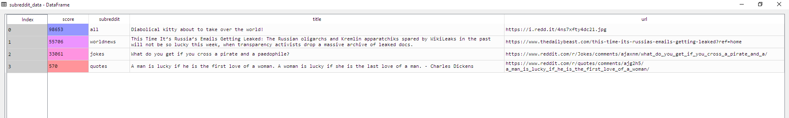

https://www.reddit.com/prefs/apps
In here you can create an app or create another app,

1) Get the keys required after creating your app and put them into a file called config.ini
Note that there is no config.ini file in this repo as it has been ignored, edit the config_example.ini file with the correct details and either change the name in the BoR.py file to read config_example.ini instead of config.ini or rename config_example.ini to config.ini

USING PEP 8 -- Style Guide for Python Code
USING PRAW : https://github.com/praw-dev/praw
Special thanks to : Felippe Rodrigues for this helpful guide to help get me started http://www.storybench.org/how-to-scrape-reddit-with-python/
